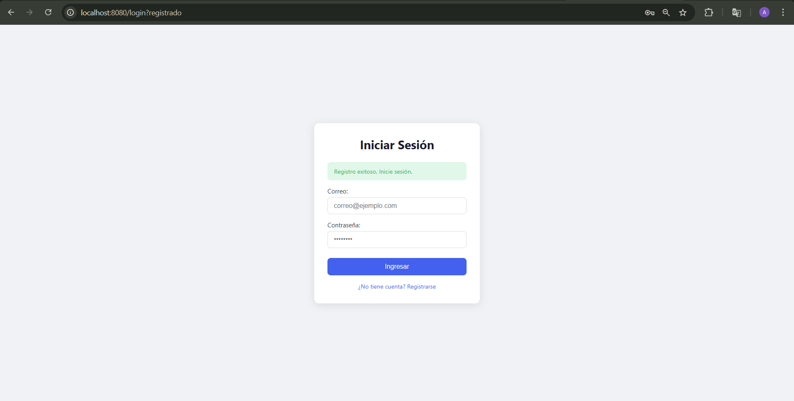
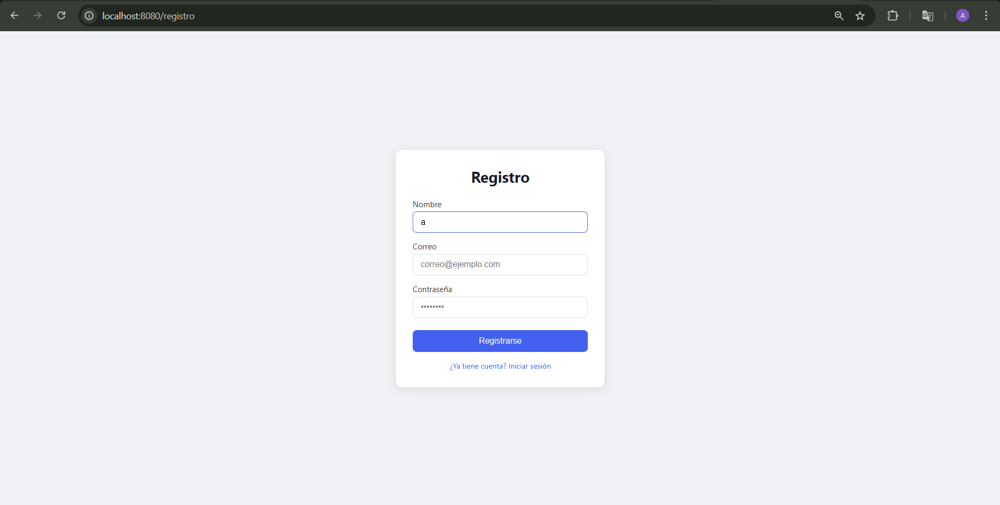
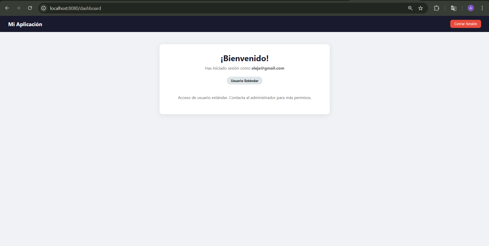
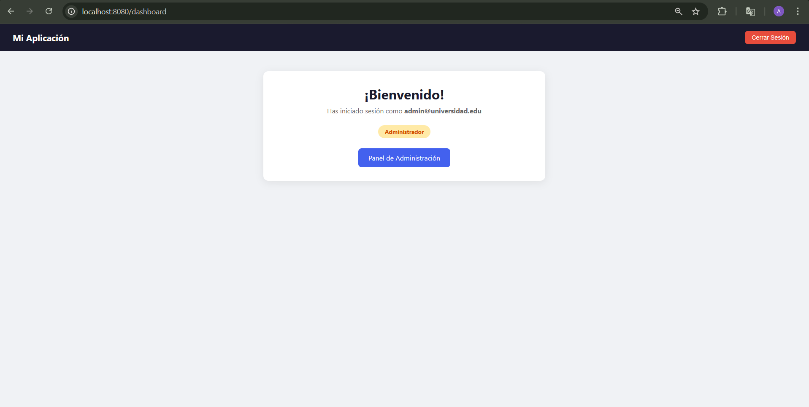
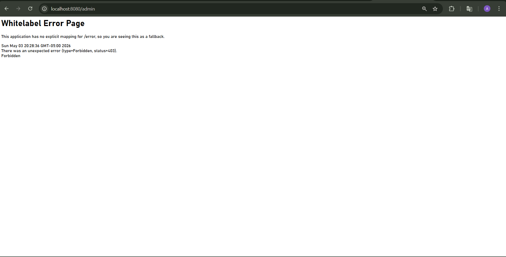
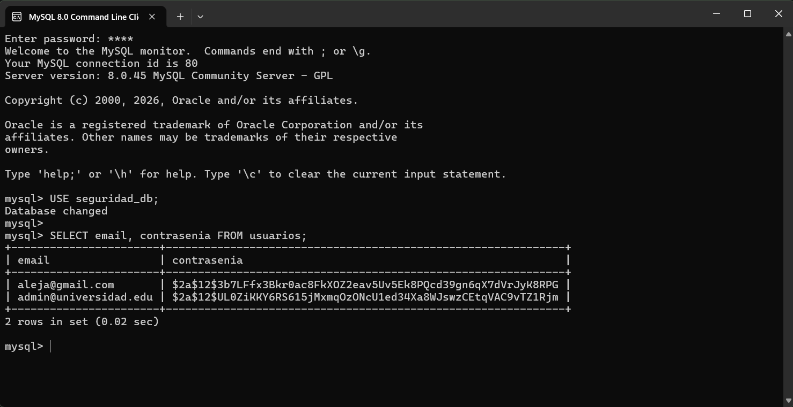

# Seguridad en Aplicaciones Web

`Unidad 9 | Alejandra Farfan Duarte | Ingeniería de Sistemas — UDES 2026`

Sistema de autenticación completo con Spring Security 6, BCryptPasswordEncoder, roles diferenciados (ADMIN / USER) y base de datos MySQL.

---

## Descripción

Aplicación web desarrollada con **Spring Boot 3.5** que implementa:

- Registro de usuarios con contraseña hasheada con **BCrypt**
- Login basado en formulario con **UserDetailsService** que consulta MySQL
- Autorización diferenciada por roles **ROLE_ADMIN** y **ROLE_USER**
- Rutas protegidas con **SecurityFilterChain**
- Logout con invalidación de sesión

---
## Configuración de MySQL

### 1. Crear base de datos y usuario

Abrir **MySQL Command Line Client** y ejecutar:

```sql
CREATE DATABASE seguridad_db CHARACTER SET utf8mb4 COLLATE utf8mb4_unicode_ci;

CREATE USER 'appuser'@'localhost' IDENTIFIED BY 'apppass123';

GRANT ALL PRIVILEGES ON seguridad_db.* TO 'appuser'@'localhost';

FLUSH PRIVILEGES;
```

### 2. Configuración en `application.properties`

```properties
spring.datasource.url=jdbc:mysql://localhost:3306/seguridad_db
spring.datasource.username=appuser
spring.datasource.password=apppass123
spring.datasource.driver-class-name=com.mysql.cj.jdbc.Driver

spring.jpa.hibernate.ddl-auto=update
spring.jpa.show-sql=true

spring.thymeleaf.cache=false
server.port=8080
```
### 3. Insertar usuario ADMIN manualmente

Ejecutar en MySQL después de arrancar la app:

```sql
USE seguridad_db;

INSERT INTO usuarios (nombre, email, contrasenia, rol, activo)
VALUES (
  'Administrador',
  'admin@universidad.edu',
  '$2a$12$UL0ZiKKY6RS615jMxmqOzONcU1ed34Xa8WJswzCEtqVAC9vTZ1Rjm',
  'ROLE_ADMIN',
  1
);
```
---

## ▶️ Cómo ejecutar el proyecto

1. Clonar el repositorio:
```bash
git clone https://github.com/tu-usuario/Farfan-post1-u9.git
cd Farfan-post1-u9
```
2. Asegurarse de que MySQL esté corriendo con la base de datos configurada.

3. Ejecutar desde IntelliJ con **Shift+F10** o desde terminal:
```bash
./mvnw spring-boot:run
```

4. Abrir el navegador en:
```
http://localhost:8080
```
---

## Usuarios predefinidos

| Nombre | Email | Contraseña | Rol |
|---|---|------------|---|
| Administrador | admin@universidad.edu | admin123   | ROLE_ADMIN |
| Usuario Normal | aleja@gmail.com | 123        | ROLE_USER |

---

## Rutas de la aplicación

| Ruta | Acceso | Descripción |
|---|---|---|
| `/` | Público | Redirige a `/login` |
| `/login` | Público | Formulario de login |
| `/registro` | Público | Registro de nuevo usuario |
| `/dashboard` | Autenticado | Panel principal |
| `/admin` | Solo ROLE_ADMIN | Panel de administración |
| `/logout` | Autenticado | Cierra sesión |

---

## Arquitectura del proyecto

```
src/main/java/com/universidad/seguridad/
├── config/
│   └── SecurityConfig.java         # SecurityFilterChain, BCrypt, AuthProvider
├── controller/
│   └── AuthController.java         # Endpoints: login, registro, dashboard, admin
├── model/
│   └── Usuario.java                # Entidad JPA
├── repository/
│   └── UsuarioRepository.java      # JpaRepository con findByEmail
├── service/
│   ├── UsuarioService.java         # Lógica de registro con BCrypt
│   └── UsuarioDetailsService.java  # Implementa UserDetailsService
└── SeguridadApplication.java

src/main/resources/
├── templates/
│   ├── auth/
│   │   ├── login.html
│   │   └── registro.html
│   ├── admin/
│   │   └── panel.html
│   └── dashboard.html
└── application.properties
```
---

## Capturas de pantalla

### Formulario de Login


### Registro de nuevo usuario


### Dashboard — Usuario Estándar (ROLE_USER)


### Panel de Administración (ROLE_ADMIN)


### Error 403 — Acceso denegado


### Contraseña BCrypt en MySQL


---
## Seguridad implementada

- Contraseñas hasheadas con **BCryptPasswordEncoder** (strength 12) — nunca se almacenan en texto claro
- Token **CSRF** incluido automáticamente por Thymeleaf + Spring Security
- Sesión invalidada completamente al hacer logout (cookie `JSESSIONID` eliminada)
- Rutas `/admin/**` protegidas exclusivamente para `ROLE_ADMIN`
- Formulario de login personalizado (reemplaza el de Spring por defecto)
